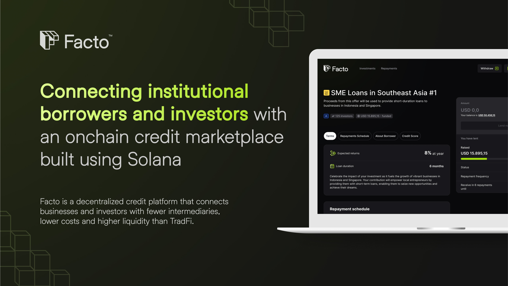

# 🏦 Facto - Revolutionizing Credit Markets for SMEs

Facto is a decentralized credit platform built 100% onchain, directly connecting institutional borrowers and investors through crowdfunding and tokenization, eliminating the need for intermediaries. Unlike typical DeFi platforms that struggle with complex onboarding, Facto ensures straightforward onboarding for both lenders and borrowers.

To learn more about Facto, check out our [introductory](https://www.loom.com/share/25f9f47a342549ae804689ef686aa4c2) video and [demo](https://www.loom.com/share/1d140532fc544376a4c555a0ee17cf62).

## 🔗 Features

- **User-Centric Experience**: Facto ensures a seamless and intuitive funding journey, offering an accessible interface designed to cater to users of all backgrounds, whether they're investors or businesses, regardless of their familiarity with blockchain technology.

- **Transparent Tokenization**: Experience transparent tokenization of financing, ensuring clarity and security throughout the funding process.

- **Efficient Crowdfunding Platform**: Facto provides an efficient crowdfunding platform, connecting investors directly with businesses in need of funding, reducing unnecessary intermediaries and streamlining the financing process.

## 💻 Technologies Used

Facto is built with the following technologies:

- **Solana**: Solana is a fast and low-cost blockchain platform for decentralized apps and crypto-currencies, known for its high transaction speed thanks to its unique consensus mechanism. It's ideal for scalable blockchain applications.

- **Anchor**: Anchor simplifies building smart contracts on Solana with a framework that makes development safer and more efficient. It offers easy APIs, integrated testing, and solutions for common challenges, aiming to streamline the development process.

- **Next/React**: Next.js enhances React apps with features like server-side rendering and static site generation, making web development faster and more efficient. It combines React's component-based architecture with performance optimizations for a better developer and user experience.

- **Web3Auth**: Web3Auth offers passwordless authentication for blockchain apps, improving security and user experience with one-click logins using blockchain technology. It simplifies access to decentralized applications by eliminating traditional login hurdles.

## 📥 Getting Started

### Install Depencies:

- Rust: https://www.rust-lang.org/tools/install
- Solana: https://docs.solanalabs.com/cli/install (Make sure to install the 1.18.8 version)
- Anchor: https://www.anchor-lang.com/docs/installation#anchor

### To get started with Facto:

```bash
$ git clone https://github.com/notuslabs/facto
```

```bash
# Installing general dependencies
$ npm install

# Generate new key pair for the program
$ solana-keygen new -o facto-keypair.json

# Generate new key pair for the paymaster
$ solana-keygen new -o paymaster-keypair.json

# Copy the paymaster-keypair.json to app/.env.local PAYMASTER_PRIVATE_KEY without "[]" equal app/.env.local.example

# Run solana test validator
$ solana-test-validator

# Copy paymaster pub key
$ solana-keygen pubkey paymaster-keypair.json

# Get airdrop for paymaster
$ solana airdrop 100 <paymaster pub key> --url l

# Get airdrop for yourself
$ solana airdrop 100 --url l

# Create fake mint token and copy the Address on output and add it on app/.env.local NEXT_PUBLIC_FAKE_MINT_ADDRESS
$ spl-token create-token --decimals 6 --owner <paymaster pub key> --fee-payer paymaster-keypair.json --url l

# Deploy program
$ npm run deploy

# Enter front-end folder
$ cd app/

# Installing front-end dependencies
$ npm install

# Running the application
$ npm run dev

# Make sure you have all environment variables
```

### Run tests:

```bash
$ npm install

$ npm run test
```

## License

© [2024] [NotusLabs]. All rights reserved. [LICENSE](LICENSE.txt).
